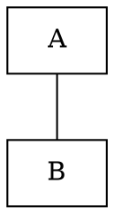
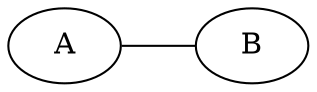

# Graphviz - Graph Visualization Software

From their [website](https://graphviz.org/)

Graphviz is open source graph visualization software. Graph visualization is a way of representing structural information as diagrams of abstract graphs and networks. It has important applications in networking, bioinformatics, software engineering, database and web design, machine learning, and in visual interfaces for other technical domains.

## Overriding Defaults

Set the default node shape to a rectangle. [Full list](https://graphviz.org/doc/info/shapes.html)

Make all nodes the same fixed sized regardless of contents.

Or for a custom fixed size.

Change graph direction from **top to bottom** to **left to right**.

